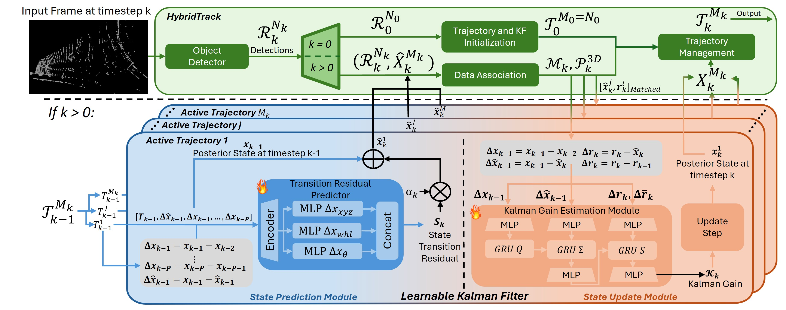

# HybridTrack: A Hybrid Approach for Robust Multi-Object Tracking

[📄 Read the paper on arXiv](https://www.arxiv.org/abs/2501.01275)


---
HybridTrack is a novel 3D multi-object tracking (MOT) framework that combines the strengths of traditional Kalman filtering with the adaptability of deep learning. Designed for traffic and autonomous driving scenarios, it delivers **state-of-the-art accuracy** and **real-time performance**—no manual tuning or scenario-specific designs required.

---
## 🏆 News

- HybridTrack has been **accepted to RAL 2025**!
---
## 🏗️ Method Architecture

> 📌 *A schematic of the HybridTrack architecture will be added here.*



<p align="center">
  
</p>

### 📦 Features
- 3D Object Tracking using LiDAR
- Learnable Kalman Filter (LKF)
- Real-time performance (112 FPS)
- High tracking accuracy without handcrafted noise or motion models
- Generalizes across different driving scenarios

### 📊 Benchmark Performance
| Method               | HOTA     | FPS   | Modality   | Model Weights                                                                 |
|----------------------|----------|-------|------------|-------------------------------------------------------------------------------|
| HybridTrack (Ours)   | **82.08%** | **112** | 3D (LiDAR) | [Download (.pth)](https://drive.google.com/file/d/1beFjycNjTtb2nDDf0vteHp1NNbR4lrvR/view?usp=sharing) |

See the paper for detailed comparison across metrics like MOTA, IDF1, and association accuracy.

### 📁 Dataset
HybridTrack is evaluated on the [KITTI Tracking Benchmark](https://www.cvlibs.net/datasets/kitti/eval_tracking.php).

---

## ⚡ Quickstart

1. **Prepare your data:** Follow the [Data Preparation Guide](docs/create_data.md) for step-by-step instructions on downloading, organizing, and linking the KITTI dataset, detections, and annotations.
2. **Install requirements:**
   ```bash
   pip install -r requirements.txt
   ```
3. **Configure and run:**
   - For training, see [Training Guide](docs/training.md)
   - For tracking, see [Tracking Guide](docs/tracking.md)

---

## 🧩 Acknowledgements

This repository builds upon the following open-source projects:
- [KalmanNet_TSP](https://github.com/KalmanNet/KalmanNet_TSP)
- [3D-Multi-Object-Tracker](https://github.com/hailanyi/3D-Multi-Object-Tracker)

We thank the authors for their valuable contributions to the community.

## 📜 Citation
If you use HybridTrack in your research, please consider citing:

```bibtex
@article{di2025hybridtrack,
  title={HybridTrack: A Hybrid Approach for Robust Multi-Object Tracking},
  author={Di Bella, Leandro and Lyu, Yangxintong and Cornelis, Bruno and Munteanu, Adrian},
  journal={arXiv preprint arXiv:2501.01275},
  year={2025}
}

```
